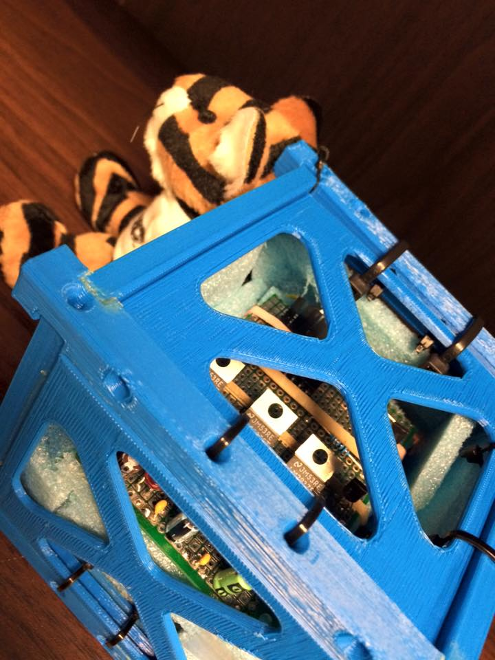
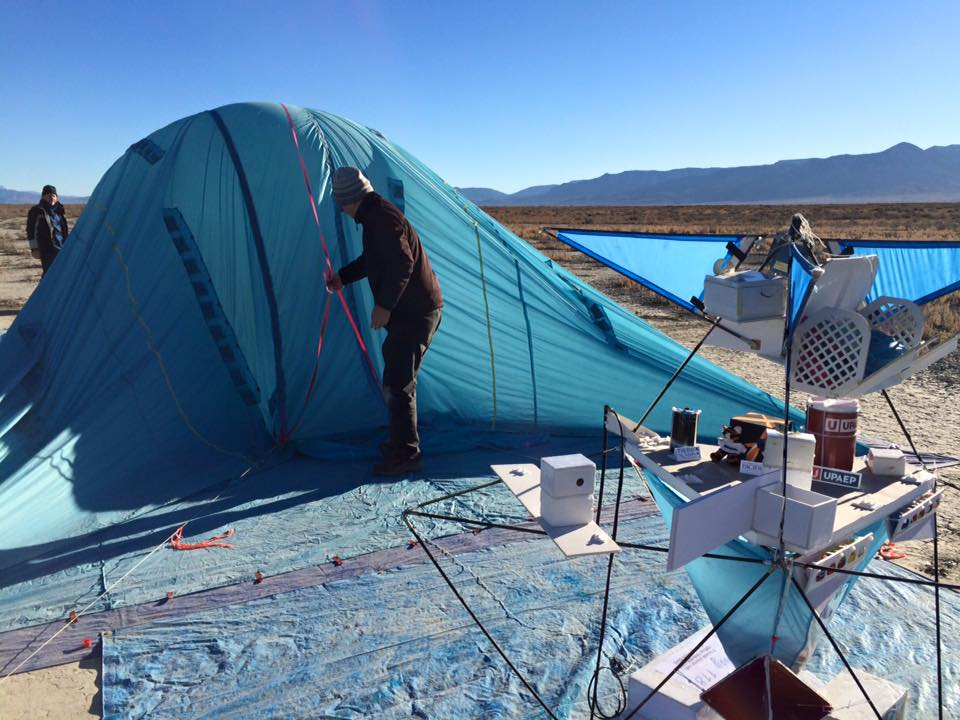
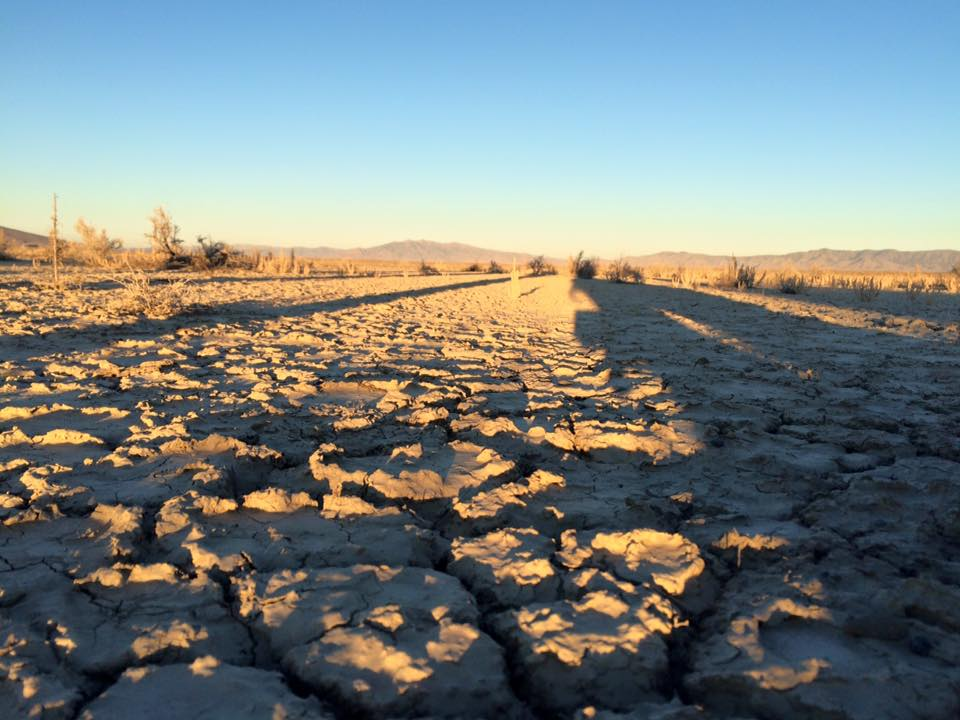
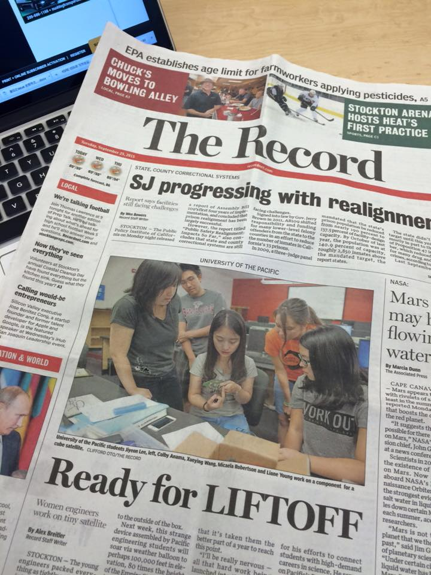
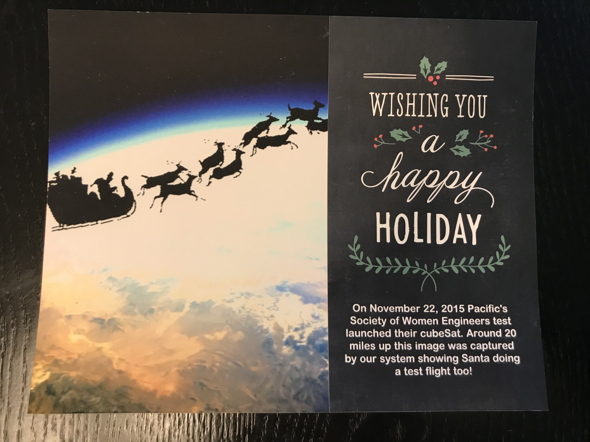
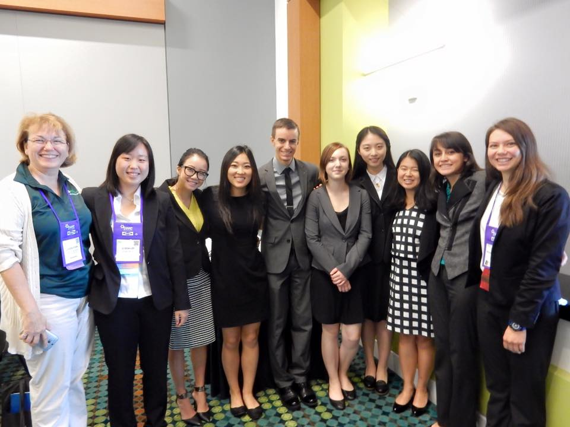

*This is not a technical blog but one of the most wonderful experience I have in my life.*  

For the 2015 Society of Women Engineers National Team Tech competition, I worked with 9 other students for 10 months on the CubeSat Payload Project, named <strong>"Eyes of the Tiger"</strong>.   

What is CubeSat? A CubeSat is a type of miniaturized satellite for space research which measures 10 cm on each side. CubeSats can have different sensors depending on their mission.  

Our payload mission is to perform Earth observations on volcanic activity, in and around the state of Puebla, Mexico. We worked closely with Tierra Luna, our sponsor, by holding weekly meetings with Charlie Galindo, and monthly meetings with previous NASA Astronaut Hernandez.  

Our design process utilized NASA's best, which stands for **B**eginning **E**ngineering, **S**cience and **T**echnology. I worked as the team leader of camera team, and also the primary presenter in the final presentation. In summary, we met all of our goals, and won the second place in the SWE national conference.  

There are a lot firsts I achieved in this period of time:
- First time build a CubeSat.
- First time go to desert. 
- First time fly a weather bollon. 
- First time send a satellite to orbit. 
- First time have my picture on U.S's newspaper. 
- First time receieved Christmas Card from advisor, made of the photo took by our CubeSat. 

